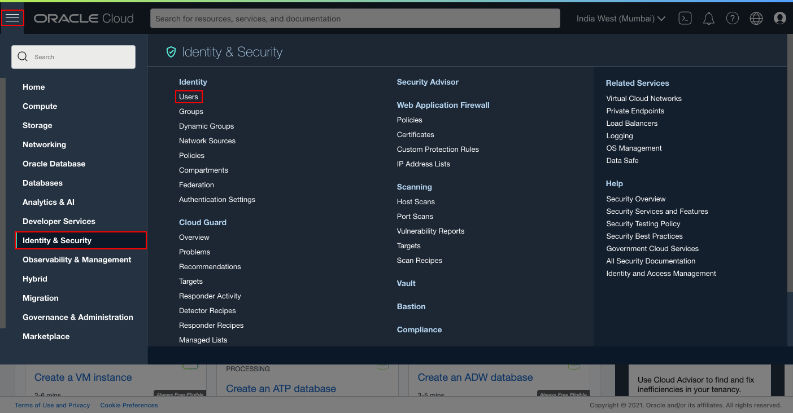
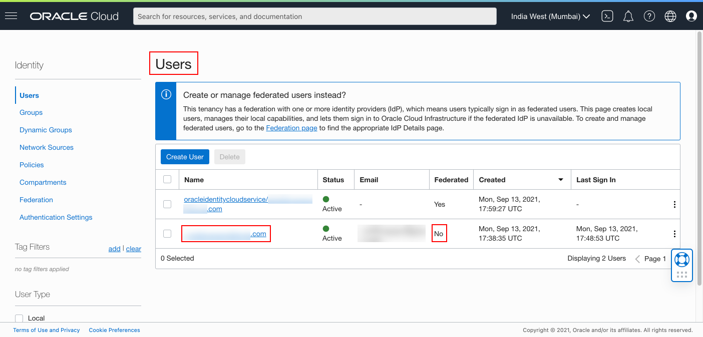
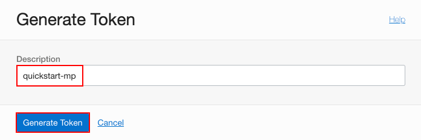
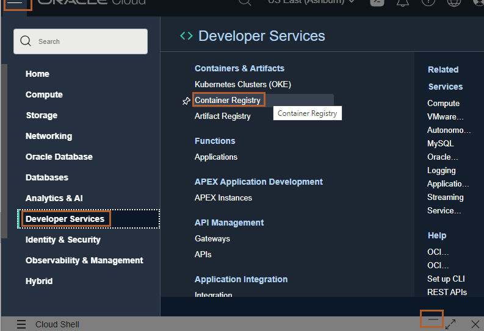
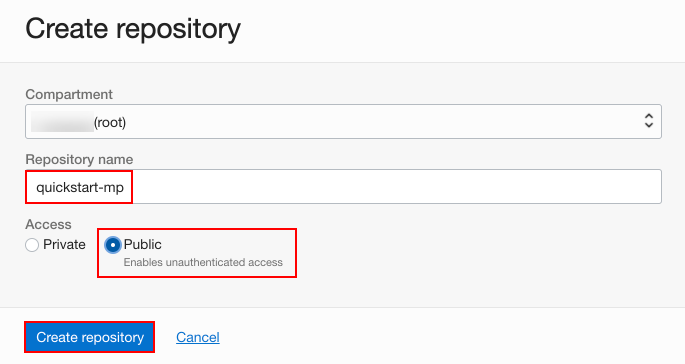
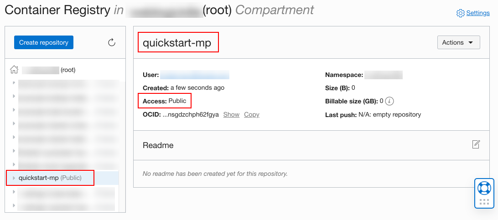
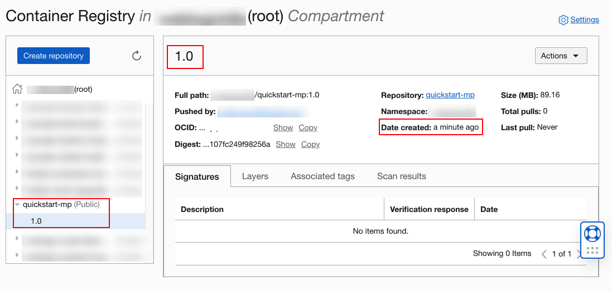

# Push the Docker Image for Helidon Application to the Oracle Cloud Container Registry

## Introduction

In this lab you will build a Docker image with your Helidon application and push that image to a repository inside the Oracle Cloud Container Registry.

### Objectives

* Build and package your application using Docker.
* Generate an Authentication Token to log in to the Oracle Cloud Container Registry.
* Push Helidon application Docker image to your Oracle Cloud Container Registry repository.

### Prerequisites

* The Helidon application you created in the previous lab
* Docker
* Oracle Cloud Account


## Task 1: Build the Helidon Application Docker Image

We'll start by preparing the Docker image that you will use to deploy on Verrazzano.

We are creating a Docker image, which you will upload to the Oracle Cloud Container Registry that belongs to your OCI account. To do so you need to create an image name which reflects your registry coordinates.

You need the following information:

* Region Name
* Tenancy Namespace
* Endpoint for the Region
>Copy this information to a text editor so that you can refer to it throughout the lab.


1. Locate your *Region Name*. <br>
Your *Region Name* is located in top right corner in the Oracle Cloud Console, in this example it is shown as *US EAST (Ashburn)*. Yours may be different.


2. Locate the *Tenancy Namespace*. <br>
In the Console, open the navigation menu and click **Developer Services**. Under **Containers & Artifacts**, click **Container Registry**.


The tenancy namespace is listed in the compartment. Copy and save it in a text editor. You will use this information in the next lab, too.


3. Locate the *Endpoint for Your Region*. <br>
Refer to the table documented at this URL [https://docs.oracle.com/en-us/iaas/Content/Registry/Concepts/registryprerequisites.htm#Availab](https://docs.oracle.com/en-us/iaas/Content/Registry/Concepts/registryprerequisites.htm#Availab). In the example shown, the endpoint for the region is *US EAST (Ashburn)* (as the region name) and its endpoint is *iad.ocir.io*. Locate the endpoint for your own *Region Name* and save it in the text editor. You will also need it for the next lab.


>Now you have both the tenancy namespace and endpoint for your region.

4. Copy the following command and paste it in your text editor. Then replace the `ENDPOINT_OF_YOUR_REGION` with the endpoint of your region name and `NAMESPACE_OF_YOUR_TENANCY` with your tenancy's namespace.

```bash
<copy>docker build -t ENDPOINT_OF_YOUR_REGION/NAMESPACE_OF_YOUR_TENANCY/quickstart-mp:1.0 .</copy>
```
When the command is ready then run in the terminal what was used to build and run the Helidon application `quickstart-mp` project. The build will produce the following result:
```bash
$ docker build iad.ocir.io/tenancynamespace/quickstart-mp:1.0 .
> docker pull iad.ocir.io/tenancynamespace/quickstart-mp:1.0
[+] Building 107.5s (19/19) FINISHED                                                                                                            
 => [internal] load build definition from Dockerfile                                                                                       0.1s
 => => transferring dockerfile: 785B                                                                                                       0.1s
 => [internal] load .dockerignore                                                                                                          0.1s
 => => transferring context: 48B                                                                                                           0.0s
 => [internal] load metadata for docker.io/library/openjdk:11-jre-slim                                                                     3.7s
 => [internal] load metadata for docker.io/library/maven:3.6-jdk-11                                                                        2.8s
 => [auth] library/openjdk:pull token for registry-1.docker.io                                                                             0.0s
 => [auth] library/maven:pull token for registry-1.docker.io                                                                               0.0s
 => [stage-1 1/4] FROM docker.io/library/openjdk:11-jre-slim@sha256:eb6b779c0a429efee5eb4bf45a3bad058ea028ac9434a24ff323b1eb73735527      33.3s
 => => resolve docker.io/library/openjdk:11-jre-slim@sha256:eb6b779c0a429efee5eb4bf45a3bad058ea028ac9434a24ff323b1eb73735527               0.0s
 => => sha256:eb6b779c0a429efee5eb4bf45a3bad058ea028ac9434a24ff323b1eb73735527 549B / 549B                                                 0.0s
 => => sha256:f3cdb8fd164057f4ef3e60674fca986f3cd7b3081d55875c7ce75b7a214fca6d 1.16kB / 1.16kB                                             0.0s
 => => sha256:9c9e40a31d4fa290f933d76f3b0a4183ba02a7298a309f6bfa892d618e7196ef 7.56kB / 7.56kB                                             0.0s
 => => sha256:99046ad9247f8a1cbd1048d9099d026191ad9cda63c08aadeb704b7000a51717 31.36MB / 31.36MB                                          18.6s
 => => sha256:e97c10298fea9915576e7ff72c6eca3d7c589aaafd6bc6481a5814c4271d2251 1.58MB / 1.58MB                                             1.6s
 => => sha256:1ad67722a7508cc8ca694c9e75efebc7c37f65d179dc2d6f36a9a1615dc5206c 211B / 211B                                                 0.7s
 => => sha256:cbeb29d69a7c2580a75906597d7cd4d59a9eff12b482810794fa01b105155358 47.13MB / 47.13MB                                          24.4s
 => => extracting sha256:99046ad9247f8a1cbd1048d9099d026191ad9cda63c08aadeb704b7000a51717                                                  7.7s
 => => extracting sha256:e97c10298fea9915576e7ff72c6eca3d7c589aaafd6bc6481a5814c4271d2251                                                  0.3s
 => => extracting sha256:1ad67722a7508cc8ca694c9e75efebc7c37f65d179dc2d6f36a9a1615dc5206c                                                  0.0s
 => => extracting sha256:cbeb29d69a7c2580a75906597d7cd4d59a9eff12b482810794fa01b105155358                                                  5.7s
 => [build 1/7] FROM docker.io/library/maven:3.6-jdk-11@sha256:1d29ccf46ef2a5e64f7de3d79a63f9bcffb4dc56be0ae3daed5ca5542b38aa2d            0.0s
 => [internal] load build context                                                                                                          0.1s
 => => transferring context: 13.99kB                                                                                                       0.1s
 => CACHED [build 2/7] WORKDIR /helidon                                                                                                    0.0s
 => [build 3/7] ADD pom.xml .                                                                                                              0.1s
 => [build 4/7] RUN mvn package -Dmaven.test.skip -Declipselink.weave.skip                                                                91.7s
 => [stage-1 2/4] WORKDIR /helidon                                                                                                         0.8s
 => [build 5/7] ADD src src                                                                                                                0.1s
 => [build 6/7] RUN mvn package -DskipTests                                                                                               10.8s
 => [build 7/7] RUN echo "done!"                                                                                                           0.5s
 => [stage-1 3/4] COPY --from=build /helidon/target/quickstart-mp.jar ./                                                                   0.1s
 => [stage-1 4/4] COPY --from=build /helidon/target/libs ./libs                                                                            0.1s
 => exporting to image                                                                                                                     0.1s
 => => exporting layers                                                                                                                    0.1s
 => => writing image sha256:587a079ad854fc79e768acda11fc05dd87d37013261249e778e80749798c2837                                               0.0s
 => => naming to iad.ocir.io/weblogick8s/quickstart-mp:1.0                                                                                 0.0s

5. Use 'docker scan' to run Snyk tests against images to find vulnerabilities and learn how to fix them.
```
This creates the Docker image, what you can check in your local repository.

```bash
$ docker images

REPOSITORY                                                                           TAG                               IMAGE ID       CREATED         SIZE
iad.ocir.io/tenancynamespace/quickstart-mp                                                1.0                               587a079ad854   5 minutes ago   243MB
```
Copy to your text editor the replaced full image name `ENDPOINT_OF_YOUR_REGION/NAMESPACE_OF_YOUR_TENANCY/quickstart-mp:1.0` because you will need it later.

## Task 2: Generate an Authentication Token to Login to the Oracle Cloud Container Registry

In this step, we are going to generate an *Authentication Token*, that we will use to log in to the Oracle Cloud Container Registry.

1. In the Console, open the navigation menu and click **Identity and Security**. Under **Identity**, click **Users**.



2. Click on the non federated user name to view the details. (The non federated user name should be your email address -without any prefix- what was used during the trial signup.)



3. In the User Detail page scroll down and click **Auth Tokens**.


4. Click **Generate Token**.


5. Copy *quickstart-mp* and paste it in the *Description* box and click **Generate Token**.



6. Click **Copy** under Generated Token and paste it in the text editor. You cannot copy it later, so make sure you have a copy of this token saved.


## Task 3: Push the Helidon Application (quickstart-mp) Docker Image to your Container Registry Repository

In Task 1 of this lab you opened a URL [https://docs.oracle.com/en-us/iaas/Content/Registry/Concepts/registryprerequisites.htm#Availab](https://docs.oracle.com/en-us/iaas/Content/Registry/Concepts/registryprerequisites.htm#Availab) and determined the endpoint for your Region name and copied it to a text editor. In our example the Region Name is US East (Ashburn). You will need this information for this task.


1. Copy the following command and paste it in your text editor and then replace the `ENDPOINT_OF_REGION_NAME` with the endpoint of your region.

  >In our example the Region Name is *US East (Ashburn)* and the endpoint is *iad.ocir.io*. You will need your specific information for this task.

```bash
<copy>docker login ENDPOINT_OF_REGION_NAME</copy>
```

2. In the previous step, you also determined the tenancy namespace.
Enter the Username as follows: `NAMESPACE_OF_YOUR_TENANCY`/`YOUR_ORACLE_CLOUD_USERNAME`. <br>
* Replace `NAMESPACE_OF_YOUR_TENANCY` with your tenancy's namespace
* Replace `YOUR_ORACLE_CLOUD_USERNAME` with your Oracle Cloud Account user name and then copy the replaced username from your text editor and paste it in the *Cloud Shell*.
* For Password, copy and paste the Authentication Token from your text editor (or wherever you saved it.)
```bash
$ docker login iad.ocir.io
Username: NAMESPACE_OF_YOUR_TENANCY/YOUR_ORACLE_CLOUD_USERNAME
Password:
Login Succeeded
```

3. Navigate back to the Container Registry. In the Console, open the navigation menu and click **Developer Services**. Under **Containers & Artifacts**, click **Container Registry**.



4. Select the compartment and then click **Create Repository**.


5. Select the compartment and enter *quickstart-mp* as the Repository Name, then choose Access as **Public** and click **Create Repository**.



6. After the repository *quickstart-mp* has been created you can verify in the repository list and its settings.



7. To push your Docker image into your repository inside the Oracle Cloud Container Registry, copy and paste the following command in your text editor and then replace `ENDPOINT_OF_YOUR_REGION_NAME`/`NAMESPACE_OF_YOUR_TENANCY`/quickstar-mp:1.0 with Docker image full name, which you saved earlier.

```bash
<copy>docker push ENDPOINT_OF_YOUR_REGION_NAME/NAMESPACE_OF_YOUR_TENANCY/quickstart-mp:1.0</copy>
```
The result should look like this:
```bash
$ docker push iad.ocir.io/tenancynamespace/quickstart-mp:1.0
The push refers to repository [iad.ocir.io/tenancynamespace/quickstart-mp]
0795b8384c47: Pushed
131452972f9d: Pushed
93c53f2e9519: Pushed
3b78b65a4be9: Pushed
e1434e7d0308: Pushed
17679d5f39bd: Pushed
300b011056d9: Pushed
1.0: digest: sha256:355fa56eab185535a58c5038186381b6d02fd8e0bcb534872107fc249f98256a size: 1786
```

8. After the *docker push* command runs successfully, expand the *quickstart-mp* repository and you will notice a new image has been uploaded in this repository.



9. Leave the *Cloud Shell* and Container Registry repository page open; you will need them for the next labs.

## Acknowledgements

* **Author** -  Peter Nagy
* **Contributors** - Maciej Gruszka, Peter Nagy
* **Last Updated By/Date** - Ankit Pandey, January 2022
